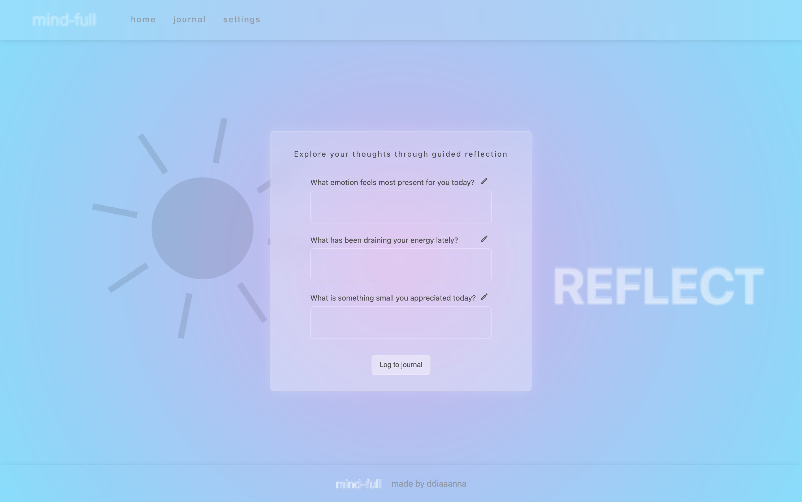
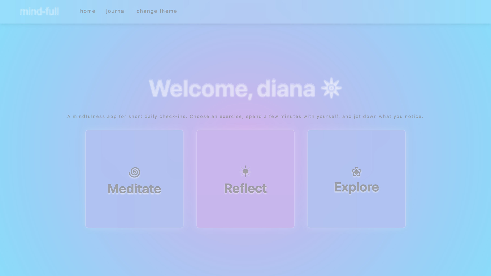
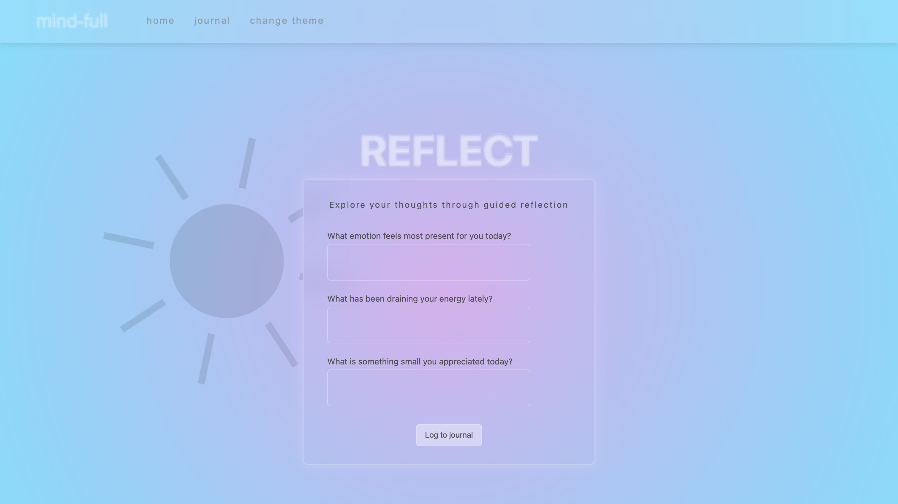

# Mindful App

A personal mindfulness companion built with React and TypeScript.

## Photos

## About

A mindfulness app designed to be easy and a pleasant user experience. The user can focus on their mindfulness goals with easy meditation timer, journal daily with guided prompts, or get a daily inspirational quote and save it to their personal journal page.

## Features

- Meditation timer (with duration choice)
- Guided journaling with customizable prompts
- Personal journal page (view & delete past entries and notes)
- Active-days calendar (tracks days you used the app)
- Name personalization / welcome flow

## Tech Stack

- React
- TypeScript
- Vite
- CSS

## Work in Progress

Coming soon:

- Daily quotes with option to save to journal
- Theme switcher
- Mobile app version built with React Native
